# Todo Application

A full-stack Todo application built with React.js,Tailwind CSS, Node.js,Express.js and based on MVC architecture.
Users can create, update, delete, and filter todo by status.

# Installation

Follow these steps to set up and run the Todo Application locally from scratch.

## 1. Clone the Repository

git clone <repository-url>

cd todo-app

## 2. Backend Setup

cd backend
npm install
create .env file
PORT = 5000

-> hardcoded data
-> src/config/config.json
{
"development": {
"username": "root",
"password": "xyz",
"database": "xyz",
"host": "127.0.0.1",
"dialect": "mysql"
}
}

npm start

## 3. Frontend Setup

cd frontend
npm create vite@latest .
npm install
npm install -D tailwindcss@3 postcss@8 autoprefixer@10
npx tailwindcss init -p

# tailwind.config.js

/** @type {import('tailwindcss').Config} \*/
module.exports = {
content: [
"./index.html",
"./src/**/\*.{js,ts,jsx,tsx}",
],
theme: {
extend: {},
},
plugins: [],
}

# postcss.config.js

module.exports = {
plugins: {
tailwindcss: {},
autoprefixer: {},
},
}

# src/index.css

@tailwind base;
@tailwind components;
@tailwind utilities;

npm run dev

## .gitignore

# Frontend

node_modules/
.env

# Backend

node_modules/
.env
src/config/config.json

## Frontend - User Interface

#### Empty Todo List

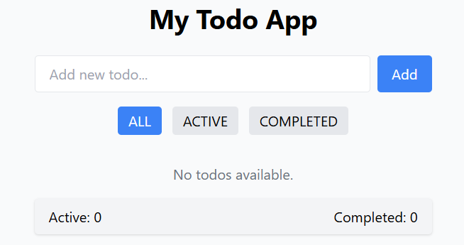

#### Add Todo

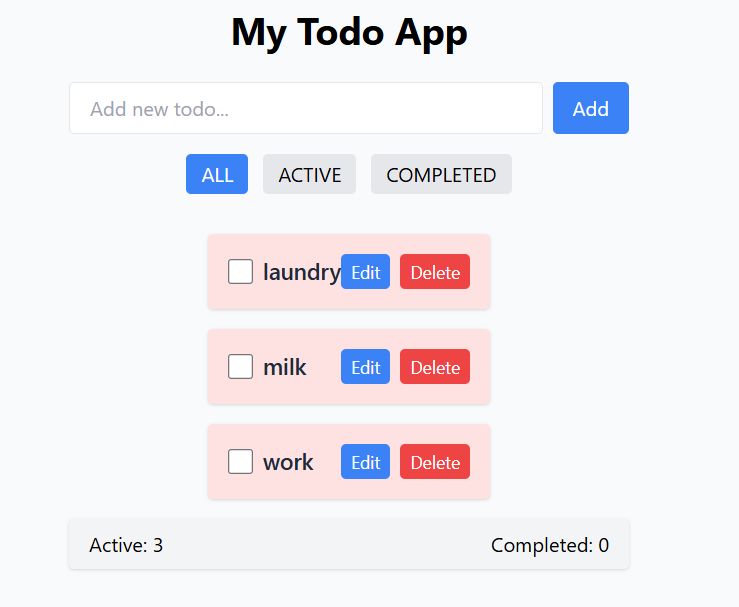

#### Active Todos Filter

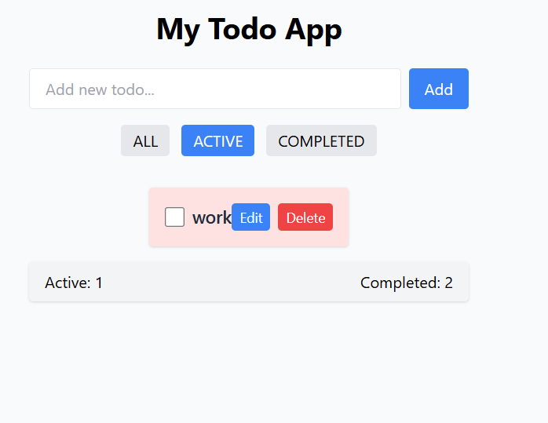

#### Completed Todos Filter

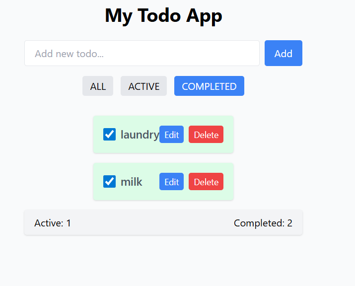

#### Edit Todo

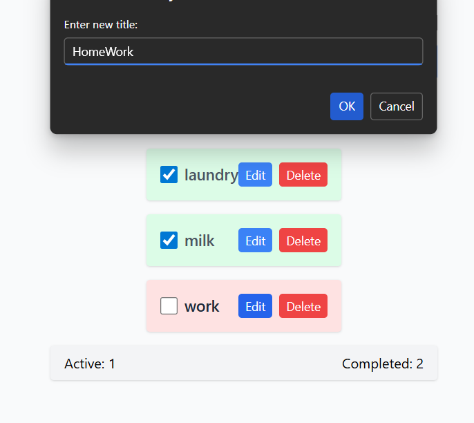
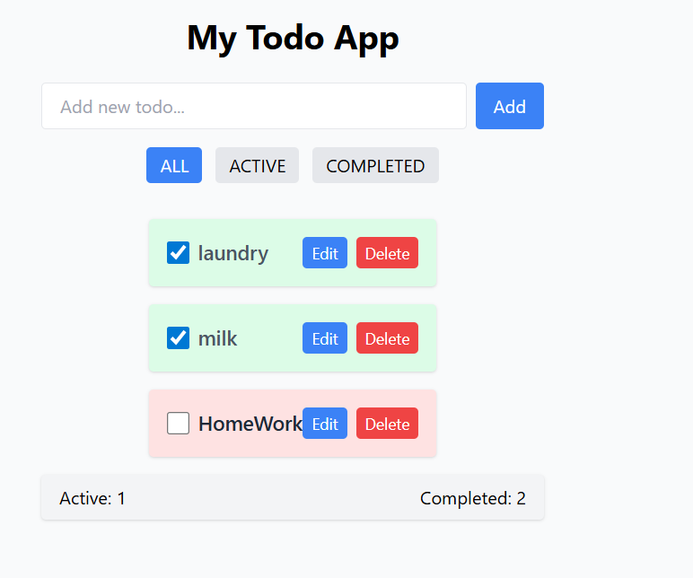

#### Delete Todo

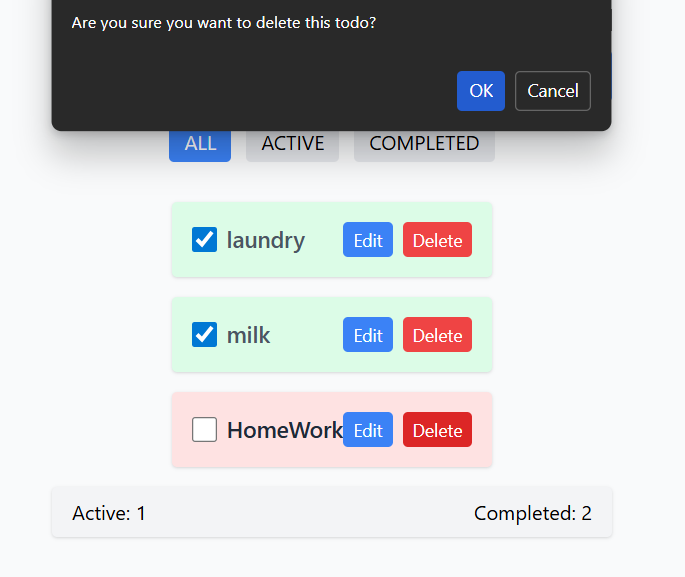
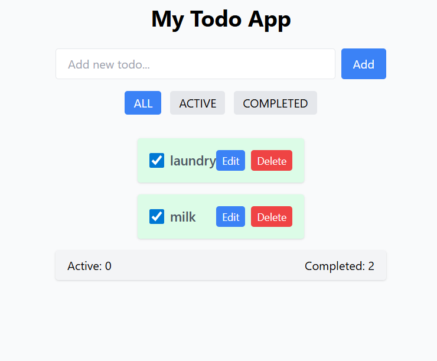

#### Backend - API and Database

# GET - Get All Todos

http://localhost:PORTNumber/api/todos
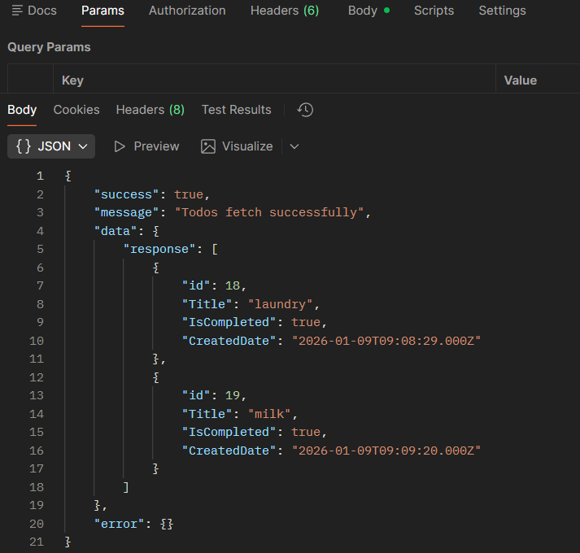

# GET - Get Todo BY ID

http://localhost:PORTNumber/api/todos/:id
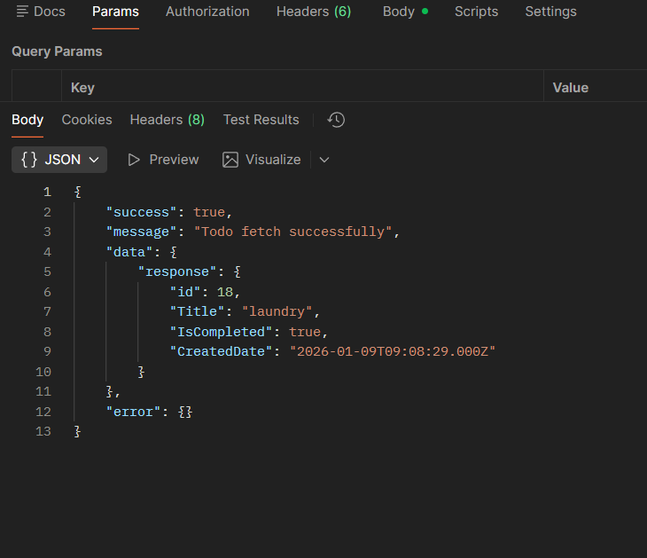

# POST - CREATE TODO

http://localhost:PORTNumber/api/todos
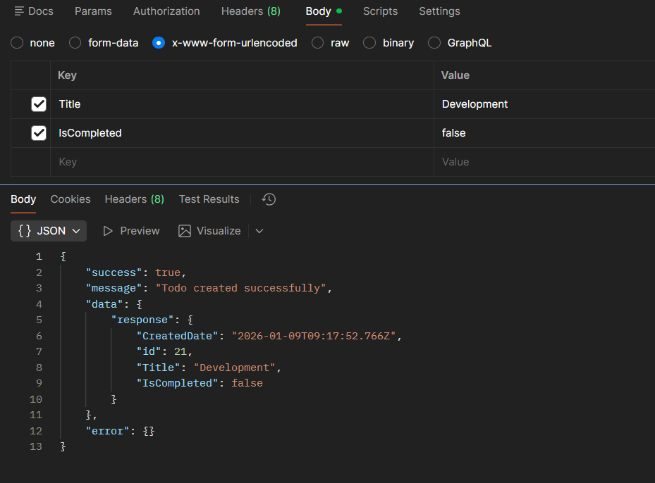

# PUT - UPDATE TODO

http://localhost:PORTNumber/api/todos/:id
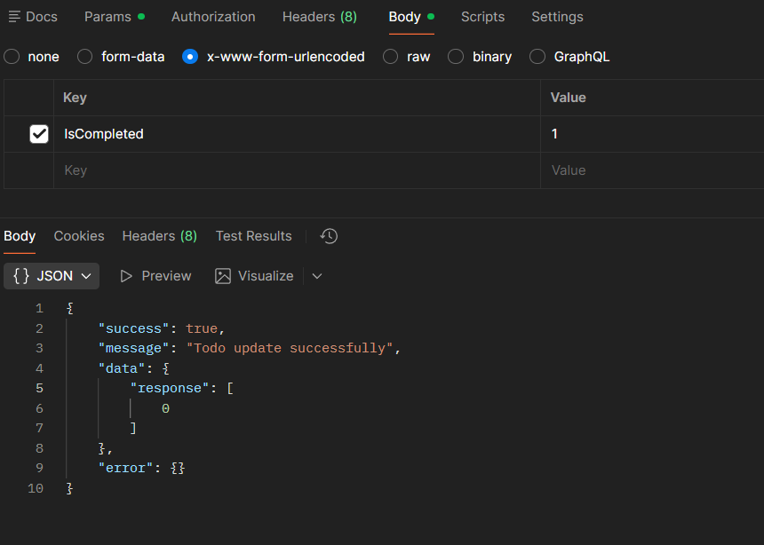

# DELETE - DELETE TODO

http://localhost:PORTNumber/api/todos/:id
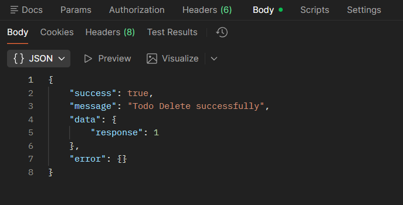

####  MYSQL Database TABLE

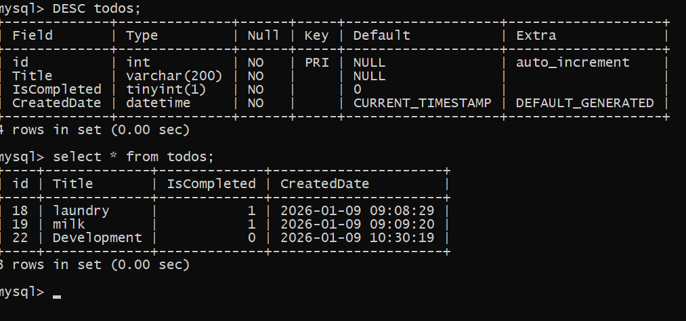